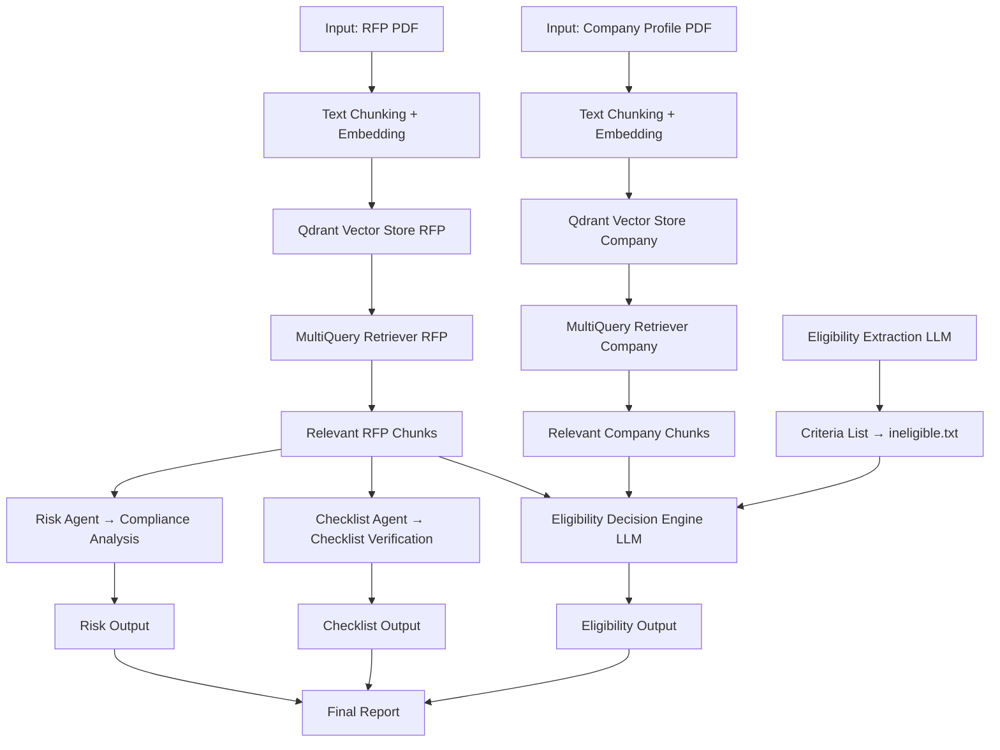
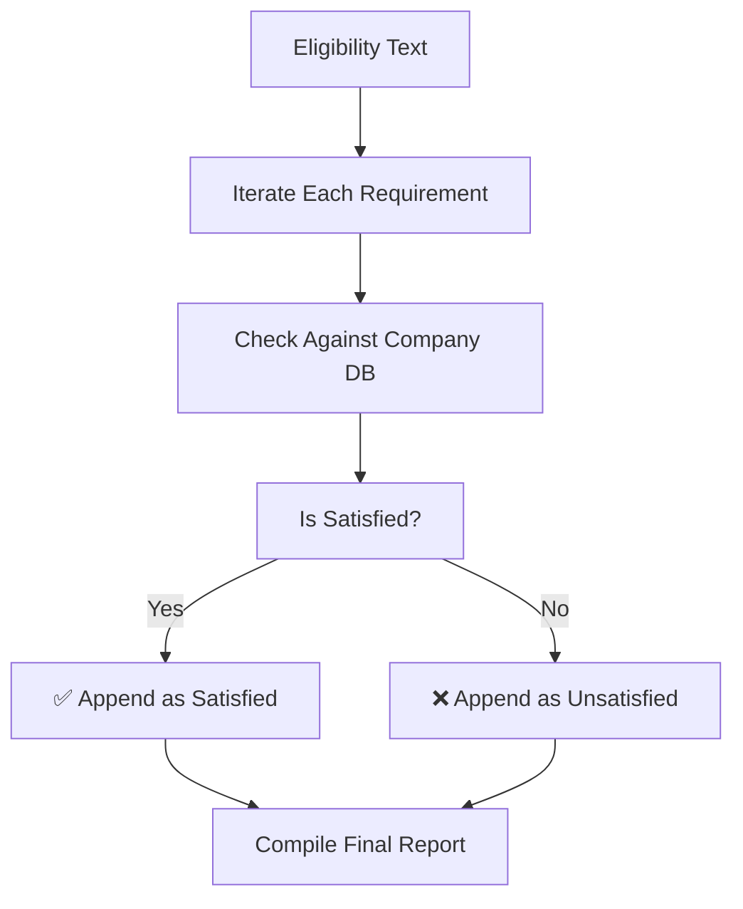

# ConsultAdd Agentic Workflows 🧠⚙️

A multi-agent intelligent document processing system built to analyze RFPs (Request for Proposals) and determine whether **ConsultAdd** qualifies to apply, using a combination of document understanding, retrieval-augmented generation (RAG), vector search (Qdrant), and large language models (LLMs) from Groq.

---

## 🔍 Problem Statement

Organizations like **ConsultAdd** face challenges when deciding whether to respond to complex RFPs. These documents contain:

- Varying eligibility requirements
- Legal and compliance language
- Industry-specific credentials and certifications

**Manual extraction is time-consuming, error-prone, and often misses critical criteria.**

---

## 🎯 Objective

- Automate the extraction of eligibility criteria
- Match them against internal organizational capabilities
- Perform submission checklist verification
- Detect and flag risk-related compliance issues
- Output clear "Eligible" or "Not Eligible" decisions
- Justify answers with pointwise explanation

---

## 🌐 Real-world Use Case

Imagine a situation where multiple RFPs arrive weekly:

- Each RFP is 20–50 pages long
- Consulting firm (ConsultAdd) has a standard capability document
- The goal is to **rapidly decide go/no-go** on proposals

This system automates the review pipeline.

---

## 📁 Directory Structure

```bash
ConsultAdd-Agentic-Workflows/
│
├── Data/                            # Input documents
│   ├── eligible1.pdf               # Sample eligible RFP
│   ├── eligible2.pdf              # Sample ineligible RFP
│   ├── ineligible.pdf     
│   └── company_data.pdf            # Internal company profile
│
├── outputs/                        # Outputs and vector stores
│   ├── qdrant_company_index/       # Qdrant store for company
│   ├── qdrant_rfp_index_el1/       # Qdrant store for eligible RFP
│   ├── qdrant_rfp_index_not_el/    # Qdrant store for ineligible RFP
│   └── ineligible.txt              # Extracted requirements
│
├── EligibilityAgent.py             # Baseline eligibility agent
├── extract_and_dump_eligibility.py # Requirement extractor
├── new_RAG.py                      # PDF-to-Qdrant pipeline
├── new_eligibilityAgent.py         # Enhanced eligibility agent
├── checklist_agent.py              # Submission checklist agent
├── risk_agent.py                   # Legal/financial risk analyzer
├── app.py                          # FastAPI backend for all agents
└── README.md
```

---

## 🔄 System Workflow



---

## 📚 Techniques and Tools Used

| Module                          | Description |
|--------------------------------|-------------|
| `PyPDFLoader`                  | Load PDF files |
| `RecursiveCharacterTextSplitter` | Efficient chunking strategy |
| `HuggingFaceEmbeddings`        | Sentence transformers for vectorization |
| `Qdrant`                       | Vector store (cloud-hosted FAISS alternative) |
| `MultiQueryRetriever`          | Expands user query for better recall |
| `LLMChain` + `PromptTemplate`  | Query composition and answer generation |
| `Groq API (deepseek-llama)`    | Ultra-fast LLM inference |
| `FastAPI`                      | Backend for serving all agents |

---

## ⚙️ Implementation Details

### 1. `extract_and_dump_eligibility.py`

Extracts lines like:

```text
- ✅ Experience: 3+ years
- ❌ Missing: ISO Certification
```

---

### 2. `new_RAG.py`

- Loads and chunks documents
- Stores them in Qdrant Cloud

---

### 3. `EligibilityAgent.py` (Baseline)

- Retrieves from RFP DB only
- Simple prompt-based eligibility check

---

### 4. `new_eligibilityAgent.py` ✅ (**Main Agent**)

- Loads both RFP and Company Qdrant vector DBs
- Uses `MultiQueryRetriever` for semantic expansion
- Reads `ineligible.txt` to structure prompt
- Returns ✅/❌ decisions and justification

---

### 5. `checklist_agent.py` ✅

- Retrieves RFP chunks
- Extracts checklists (submission format, number of copies, digital requirements, etc.)
- Uses LLM to verify checklist completeness

```text
✅ Format: PDF submitted
✅ Copies: 2 hard copies mentioned
❌ Missing: Digital signature
```

---

### 6. `risk_agent.py` ✅

- Retrieves legal/financial sections from RFP
- Flags clauses like indemnity, penalties, unresolved disputes, liability, etc.
- Returns structured risk report

```text
❌ High: Indemnity clause shifts total liability to vendor
✅ Low: No mention of unresolved litigation
❌ Medium: Penalties 5% per week delay
```

---

### 7. `app.py` ✅ (**FastAPI Backend**)

- Exposes each component as REST API:
  - `/extract-eligibility`
  - `/index-documents`
  - `/eligibility-agent`
  - `/checklist-agent`
  - `/risk-agent`

---

## 🔍 Deep Dive: Eligibility Logic



---

## 📊 Example Output (LLM Response)

```text
Eligibility Decision: ❌ Not Eligible
Checklist Issues: ❌ Digital signature not included
Risks Identified:
- ❌ High indemnity liability
- ❌ Penalty for late delivery: 5% per week
```

---

## ✅ Evaluation Table

| Criteria             | Eligible RFP | Ineligible RFP |
|----------------------|--------------|----------------|
| SAM Registration     | ✅           | ❌             |
| ISO/SOC2 Certified   | ✅           | ❌             |
| 3+ Years Experience  | ✅           | ✅             |
| Technical Staff      | ✅           | ❌             |
| Digital Signature    | ✅           | ❌             |
| Indemnity Clause     | ❌           | ❌             |

---

## 🚀 Setup and Execution

```bash
pip install -r requirements.txt
python extract_and_dump_eligibility.py
python new_RAG.py
python new_eligibilityAgent.py
python checklist_agent.py
python risk_agent.py
```

To serve all via API:
```bash
uvicorn app:app --reload
```

---

## 🛣️ Roadmap

- [x] ✅ Eligibility Agent
- [x] ✅ Checklist Agent
- [x] ✅ Risk Analysis Agent
- [ ] 🔁 LangChain `AgentExecutor` orchestration
- [ ] 🧠 Agent collaboration/coordination layer
- [ ] 📊 Web dashboard (Streamlit or Vercel frontend)

---

## 🛠️ Built With

- 🦜 LangChain
- 💬 Groq (deepseek-llama)
- 🔍 Qdrant
- 🤗 HuggingFace
- ⚡ FastAPI
- 🐍 Python 3.10+

---
